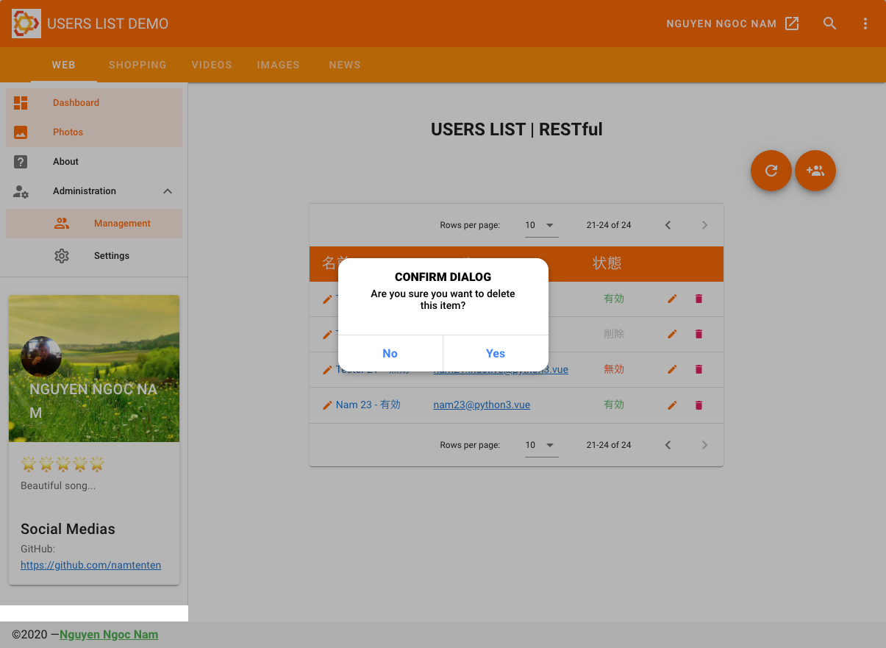
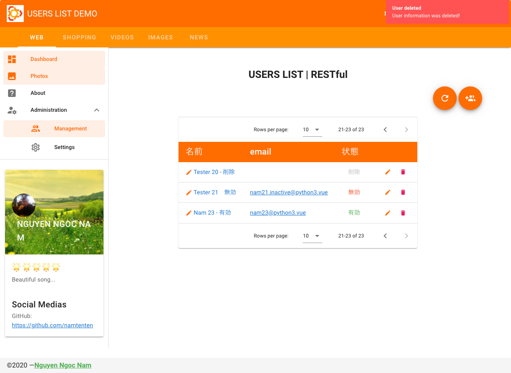
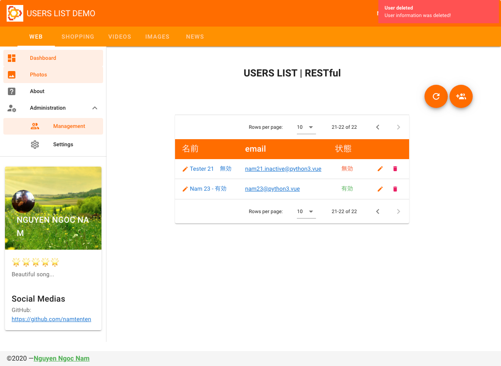
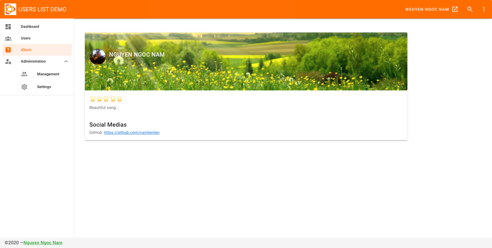

# vuetify_users_list

[](https://www.paypal.me/rakujin)

## Demo







## Project setup

### Run API server first
```
npm install
```

### Compiles and hot-reloads for development
```
python3 server.py
```

http://127.0.0.1:5000/

http://127.0.0.1:5000/api/users

http://127.0.0.1:5000/api/users/1

### Run web server
```
npm run serve
```

### Compiles and minifies for production
```
npm run build
```

### Lints and fixes files
```
npm run lint
```

### Customize configuration
See [Configuration Reference](https://cli.vuejs.org/config/).
